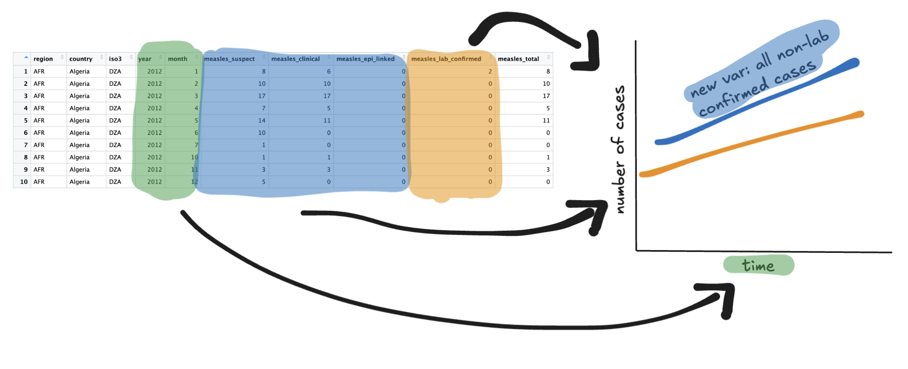
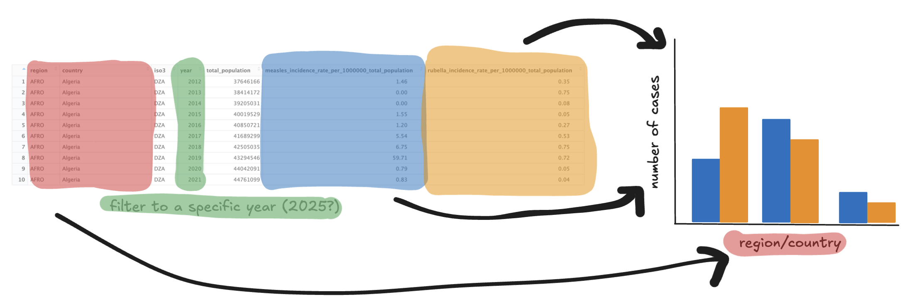

The data is from the World Health Organisation, specifically the provisional monthly measles and rubella data. It contains both monthly and yearly information, including variables such as region, country, the number of suspected, clinically-compatible, epidemiologically-linked, laboratory-confirmed, and total measles and rubella cases, and the number if discarded cases. The yearly data also includes incidence rate and discard proportions per 100000 total population.

For these data, the variable names were cleaned and data types were fixed. I did notice that some variables had instances of negative values that might not be reasonable because counts/proportions/etc. should be positive (`measles_clinical`, `discarded_cases`, etc.), so we will likely need to investigate those further and perform some additional cleaning.

With these data, I would be interested in investigating how the global number of measles cases has changed over time, specifically the proportions of suspected vs. confirmed cases (see Image 1 below). I would also like to investigate specific countries or regions and see how the numbers for both measles and rubella compare across locations, perhaps in the most recent year (see Image 2 below).

These data do not contain any information about the countries/regions, so I would additionally be interested in incorporating some demographic data to see if associations with the proportion of measles cases can be identified. I we were able to find good data on vaccination records (for the MMR vaccine or similar), I think analyzing that relationship would be quite interesting as well.

